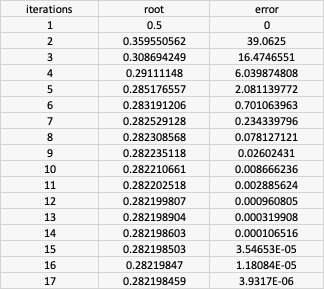

## Numerical Analysis

[Back](https://varunkodathala.github.io/Numerical_Methods/)

## False Position Method (Theoretical and Programmatic Approach)

**Also Refers to _Regula - Falsi_ and _Method of Chords_**

## Math Behind the Regula - Falsi or False Position or Method of Chords

**_According to Math Dictionary the root of a equation f(x) lies on the chord joining the points (a,b) where (a,b) satisfy f(a).f(b) < 0_**

Generic Formula is given by:

<p align = "center">


</p>

## How False - Position is useful in root optimisation?

This is important topic to discuss here. So, let's get some intution about it.

Try to Visualize few points from the graph below

<p align = "center">

</p>

General Formula is given by:

<p align = "center">

</p>

Where (a,b) should be updated iteratively according to the algorithm given below:

The descriptive algorithm is as follows:

```
1. Start

2. Input Equation

3. Find Range and initialize (a = min_range, b = max_range)

4. repeat
  {
    compute root r = {[(b-a)*f(a)]/[(f(b)-f(a)]}
    check if f(r) >0 :
       set b = r
    else:
       set a = r
  }
```
## General Description:

1. The zero of a curve always exist between the points where the curve tends to negative and positive respectively. 

2. So, the false-position methods determines the point of the end points described above. The root may lie in the left half else in the right half that is estimated using the algorithm discussed above.

3. Again we have two points and the root lie between these two points and hence false-position method should be applied again to get another range.

4. This process is repeated likewise till the iterations we match or from the [error analysis](https://varunkodathala.github.io/Numerical_Methods/error_analysis).

## Graphical Intution:

<p align = "center">

</p>

## Root Analysis through Iterations

Equation: 
<p align = "center">

</p>

Range Obtained from the [previous understanding](https://varunkodathala.github.io/Numerical_Methods/introduction):

(a,b) = (0,1)

Root Analysis:



**Snippets that support MATLAB/ OCTAVE and Python3**

## MATLAB SCRIPT

```
% MATLAB SCRIPT FOR FALSE - POSITION METHOD
clc;
clear all;
close all;
f = @(x) (x^5 - 8*x^4 + 39*x^3 -62*x^2 + 50*x - 10);
min_range = 0;
max_range = 1;
n =1 ;
while(1)
% root(n) = (min_range+max_range)/2;
root(n) = (max_range - ((max_range - min_range)/(f(max_range)-f(min_range)))*f(max_range));
% if f(rbs)<f(rfp)
%     root(n) = rbs;
% else
%     root(n) = rfp;
% end
if(f(root(n))<0)
        min_range = root(n);
end
if(f(root(n))>0)
        max_range = root(n);
end
if n>1
    p = root(n);
    q = root(n-1);
    er(n) = abs((p - q)/p)*100;
    disp('Percentage Error is ');
    disp(er(n));
if(er(n)<(1/10^(6-1)))
    disp(root(n));
break;
end
end
n=n+1;
end
iterations = n;
i = 1:iterations;
er = er';
i = i';
root = root';
t = table(i,root,er)

```
## Python3 SCRIPT

```
# Python3 Script for Bisection Method


def f(x):
    
    return x**2 - x - 2

min_range = 1
max_range = 4
root = []
er = []
n =0 
er.append(100)
while(1):
    root.append(max_range - ((max_range - min_range)/(f(max_range)-f(min_range)))*f(max_range))
    if(f(root[n])<0):
            min_range = root[n]
    if(f(root[n])>0):
            max_range = root[n]
    
    if n>0:
        p = root[n]
        q = root[n-1]
        er.append(abs((p - q)/p)*100)
        print('Percentage Error is ')
        print(er[n])
        if(er[n]<(1/10**(4-1))):
            print(root[n])
            print(n+1)
            break
    n=n+1;

```
